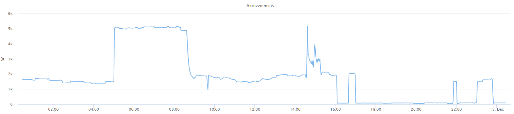

# Taust

Scriptike on kirjutatud oma tarbeks, seega võib sisaldada veidraid konstante jmt. staatilisi jupikesi, mis on seotud minu koduse süsteemiga

# Kasutus

Seadista conf failis: victron_nps_localconf.py

Käivita scripti "victron_nps_ess.py" kas crontabiga iga X minuti järel või terminalis näiteks "watch -n 200 python victron_nps_ess.py"

Minimaalselt vaja käivitada kord tunnis (näiteks esimesel minutil), et tehtaks tunni kohta õige otsus, samas kui koormus muutub, võib käivitada kasvõi iga 5 min järel.

# Toimimine:

Korra ööpäevas loetakse netist NPS järgmise päeva hinnad

Valitakse välja kõige soodsamad tunnid aku laadimiseks

Kõige kallimatel tundidel kasutatakse akut ja elektrit võrgust ei võeta

Vastavalt aku laetusele lisatakse jooksvalt tunde (päevane päikese laadimine, väiksem tarbimine) või visatakse mõni tund välja (suurenev koormus)

Akusse jäetakse lisaks võrgust laadimisele "ruumi" ka järgmise päeva päikeseelektriga laadimiseks

Laadimistunde vähendatakse vastavalt laadija võimsusele ja aku laetusele, et kasutada ära võimalikult soodsad tunnid

# todo:

Arvestada ajalugu, et aku pidevalt SoC alumises otsas poleks (umbes nagu victron battery optimizer)

Logida tarbimist hindamaks paremini keskmist (praegu kasutatakse viimase mõõtmise hetkevõimsust)

Keskmise laadimishinna juures võtta arvesse ka päikeseelektrist nullhinnaga laadimine (või arvestada võrkumüümise hinda)

Logimine

# tulemus:
Tarbimine võrgust: 
